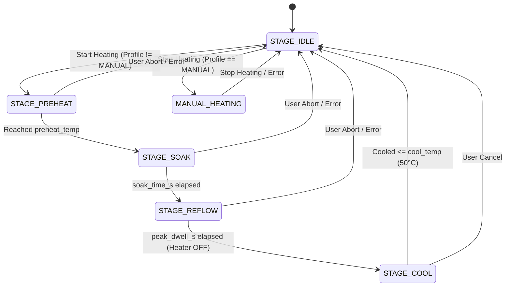

# Tejasvini Firmware Architecture

This document provides a comprehensive technical overview of the software architecture, subsystem interactions, control loops, and memory organization of the **Tejasvini** heatplate controller firmware.

---

## 1. System Overview & Execution Model

Tejasvini runs on a **Raspberry Pi Pico (RP2040)** with dual ARM Cortex-M0+ cores. The current firmware executes on **Core 0** in a cooperative, non-blocking polling model inside `loop()`, ensuring predictable timing, low latency, and deterministic memory behavior without complex inter-core synchronization.

```mermaid
graph TD
    A[Tejasvini.ino loop] --> B[input_handler_update]
    A --> C[thermal_control_update]
    A --> D[display_manager_update]
    A --> E[telemetry_update]
    A --> F[yield]

    B --> B1[Rotary Encoder Quadrature Decoding]
    B --> B2[Button Debounce Short/Long Press]

    C --> C1[read_oversampled_adc 32x Trimmed]
    C --> C2[Raw ADC & Temp Bounds Check]
    C --> C3[EMA Low-Pass & Slew Limiter]
    C --> C4[PI Controller & Soft-Start Ramp]
    C --> C5[update_ssr_actuation Time-Proportioning]
    C --> C6[Thermal Runaway & Divergence Checks]

    D --> D1[update_profile_and_progress State Machine]
    D --> D2[ui_tick EEZ Studio]
    D --> D3[lv_timer_handler LVGL Renderer]
    D --> D4[dvi_flush_cb PicoDVI Draw]

    E --> E1[Serial USB CDC & Serial1 UART 115200]
```

### Main Execution Loop Breakdown
| Function | Frequency / Interval | Purpose |
| :--- | :--- | :--- |
| `input_handler_update()` | Continuous (~100-200 Hz) | Instant quadrature edge detection and button debouncing |
| `thermal_control_update()` | SSR: Continuous PI Loop: 10 Hz (100 ms) | Time-proportioning SSR actuation and 100ms PI temperature regulation |
| `display_manager_update()` | Continuous (~30-60 Hz) | LVGL tick handling, UI animations, reflow state transitions, DVI flush |
| `telemetry_update()` | 1 Hz (1000 ms) | Formatted telemetry output over USB Serial and Hardware UART |

---

## 2. Thermal Control & Safety Subsystem (`src/thermal_control`)

### 2.1 Sensor Acquisition Pipeline
Dual 100K NTC thermistors (`PIN_NTC1` on ADC0/GPIO 26, `PIN_NTC2` on ADC1/GPIO 27) are read through a 3-tier filtering pipeline:

1. **32x Oversampling with Outlier Rejection (`read_oversampled_adc`)**:
   - 32 analog samples acquired with 4µs settling delays.
   - Sorted in-place using an insertion sort on a small stack buffer.
   - The 6 highest and 6 lowest readings are discarded (trimmed mean).
   - The 20 middle samples are averaged, eliminating power rail switching spikes, DVI noise, and ADC glitch pulses.
2. **Fast Raw ADC & Electrical Bounds Check**:
   - Raw ADC values must lie strictly between `ADC_MIN_VALID_COUNTS` (50) and `ADC_MAX_VALID_COUNTS` (4050).
   - Raw temperatures must lie strictly between `NTC_MIN_VALID_TEMP` (-20°C) and `NTC_MAX_VALID_TEMP` (300°C).
   - If either sensor violates these bounds (broken wire, loose plug, or dead short), `trigger_safety_shutdown()` trips **immediately** ($< 100\text{ms}$) without passing the corrupt value to the smoothing filter.
3. **EMA Low-Pass Filter + Physical Slew Limiter**:
   - Exponential Moving Average ($\alpha = 0.08$) smooths sensor noise.
   - A physical slew limiter clamps the maximum allowable temperature change to `0.25°C` per 100ms step (equivalent to $2.5^\circ\text{C}/\text{s}$ max rise/fall).

### 2.2 PI Regulation & Soft-Start Ramping
* **Soft-Start Ramping**: Rather than stepping the PI setpoint directly to the target temperature, `reference_temp` ramps towards `set_temp` at a rate of `RAMP_RATE_DEG_PER_SEC` ($1.5^\circ\text{C}/\text{s}$). This prevents severe thermal shock to delicate ceramic SMD components and reduces heater overshoot.
* **PI Controller**:
  $$e(t) = T_{\text{ref}}(t) - T_{\text{measured}}(t)$$
  $$u(t) = K_p \cdot e(t) + K_i \cdot \int e(t)\,dt$$
  - $K_p = 1.5$, $K_i = 0.02$.
  - Integration accumulator is time-scaled ($dt$ integration) and includes **anti-windup clamping**: accumulator growth is frozen when the output saturates at `MAX_DUTY` (40%) or `MIN_DUTY` (0%).

### 2.3 SSR Actuation: Time Proportioning
Because AC Solid State Relays (such as the Fotek SSR-25DA) switch on AC zero-crossings (every 10ms for 50Hz or 8.33ms for 60Hz), standard high-frequency PWM cannot be used.
Tejasvini uses **Time-Proportioning Slow PWM** (`SSR_TIME_PROPORTIONING 1`):
* A 1000ms cycle window (`SSR_WINDOW_MS 1000`) is established.
* At 40% duty, the SSR pin is driven HIGH for 400ms and LOW for 600ms.
* `update_ssr_actuation()` is evaluated continuously on every loop pass for sub-millisecond switching accuracy.

### 2.4 Multi-Layered Safety Interlocks
1. **Emergency Over-Temperature Shutdown**: If composite or individual sensor temperature exceeds `OVERTEMP_SHUTDOWN` (280°C), the SSR is instantly killed and locked out.
2. **Sensor Divergence Lockout**:
   - **Pre-Heat**: Both sensors must agree within `MAX_STARTUP_NTC_DIFF` (15°C) before heating is permitted to start.
   - **Active Heating**: If sensors diverge by $> 35^\circ\text{C}$ (`MAX_NTC_DIFF`) for 5 consecutive cycles (500ms debounce), the heater is shut down.
3. **Thermal Runaway Monitor**:
   - When driving $\ge 20\%$ duty with a deficit $> 10^\circ\text{C}$, temperature must rise by at least `SAFETY_THRESHOLD` (2.0°C) within `SAFETY_PERIOD` (18 seconds).
   - Hysteresis prevents timer starvation under fluctuating power.
4. **Centralized Fail-Safe Shutdown (`trigger_safety_shutdown`)**:
   - Latches `error_state = true`.
   - Forces `heater = false`, `duty = 0.0f`, `acc = 0.0f`.
   - Directly writes `PIN_SSR` LOW.
   - Requires explicit user interaction to reset.

---

## 3. Display & UI Subsystem (`src/display_manager` & `src/ui`)

### 3.1 Display Pipeline (PicoDVI & LVGL 8.3.x)
* **Hardware Output**: PicoDVI generates a 400x240 RGB565 DVI signal at 60Hz. The Elecrow CrowPanel RTD2281 scaler board upscales this 2x to fill the 800x480 native LCD panel.
* **Rotation**: The display is rotated 270° (`setRotation(3)`), presenting a logical **240x400 Portrait** UI to LVGL.
* **Partial Buffer Strategy**: LVGL renders into an 8-line partial buffer (`240 * 8 * 2 = 3840 bytes`), consuming negligible SRAM while providing artifact-free rendering.
* **Touch Controller**: Bridges GT911 capacitive touch over I2C (GPIO 20 SDA, GPIO 21 SCL), converting touch coordinates to 240x400 portrait space.

### 3.2 Reflow Profile State Machine
`display_manager.cpp` manages an automated 4-stage reflow state machine:

Supported profiles:
1. **MANUAL**: Direct setpoint control (0 - 270°C).
2. **LEAD FREE (SAC305)**: Preheat 150°C (90s) $\to$ Soak 175°C (60s) $\to$ Peak Reflow 245°C (30s dwell) $\to$ Cool to 50°C.
3. **LEADED (Sn63Pb37)**: Preheat 130°C (80s) $\to$ Soak 155°C (60s) $\to$ Peak Reflow 215°C (30s dwell) $\to$ Cool to 50°C.
4. **LOW TEMP (Sn42Bi58)**: Preheat 90°C (60s) $\to$ Soak 115°C (45s) $\to$ Peak Reflow 150°C (25s dwell) $\to$ Cool to 45°C.

---

## 4. Memory Footprint & Resource Budget

The RP2040 features 264 KB on-chip SRAM:

| Memory Region | Allocation | Notes |
| :--- | :--- | :--- |
| **PicoDVI Framebuffer** | ~153.6 KB | Contiguously allocated in dynamic heap by `DVIGFX16` |
| **Static Data (.data + .bss)** | ~20.2 KB | Global state, buffers, LVGL static tables |
| **LVGL Draw Buffer** | 3.84 KB | 8 lines $\times$ 240 pixels $\times$ 2 bytes (RGB565) |
| **Remaining Free Heap & Stack**| >85 KB | Available for LVGL dynamic objects and call stack |
| **Flash Usage** | ~366 KB / 2 MB (17%)| Ample space for additional profiles, fonts, and assets |
